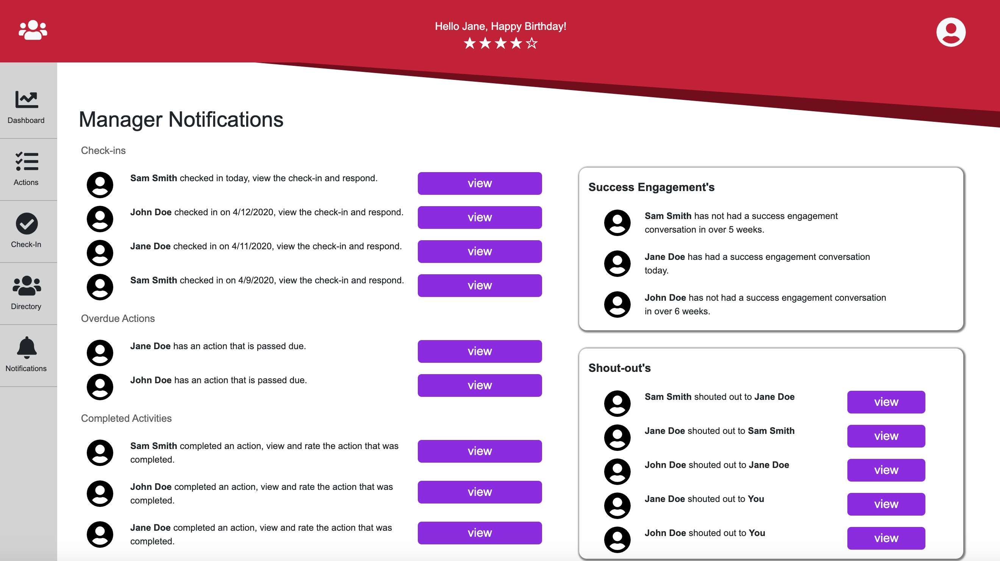
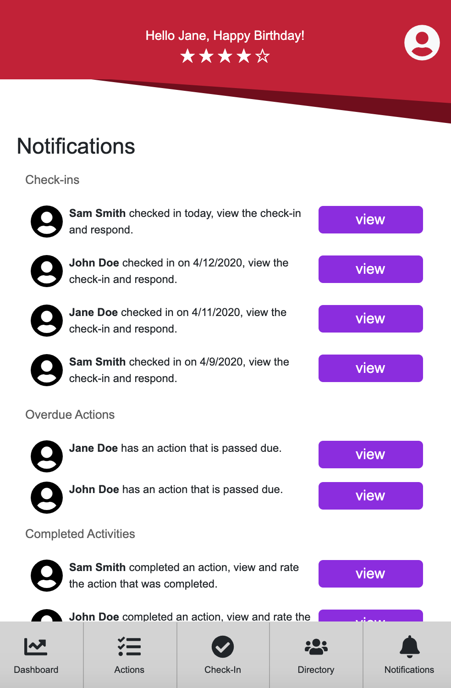

# Success Rocket Notifications Page

Built with ReactJS, Mock-up notification page for Success Rocket, an employee success tracking software coming soon. 

---

## Usage

Clone and run NPM RUN START in CMD LINE to view dynamic functionality.

---

## Installation

1. Head over to the [Rocket repository](https://github.com/garrettwalter/rocket)
2. Press the green 'code' button and select method of download
4. Open the repo in your text editor of choice
5. Execute `npm install`, then `npm start`

---

## License

Licensed under the [MIT](https://opensource.org/licenses/MIT) license.